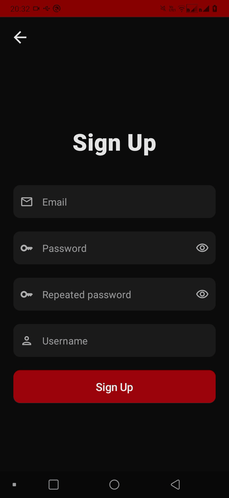

  

<h1 align="center">
  Quotes
</h2>

  
  
   
  

Projeto criado com o objetivo de consumir a minha [API de frases](https://github.com/jsericksk/Quotes-Api). É um projeto pessoal unicamente de estudos e foi criado apenas para treinar um pouco a implementação do app com a API. Na arquitetura, foram utilizados conceitos de **clean architecture + MVVM**.

Como objetivo principal, a ideia era apenas consumir a API. Como objetivo secundário, eu queria aprender melhor na prática a abordagem dos tokens, desde a utilização do **OkHttp** para interceptar as requests com access token/tentativa de obter um novo access token a partir de um refresh token, até a forma de armazenamento dos tokens em si.

## :pencil2: Funcionalidades

- Registro e login de usuário;
- CRUD completo de frases: publicar, obter, atualizar e excluir frases;
- Pesquisar frases;
- Paginação.

## :key: Sistema de tokens

A API é protegida por access token que pode ser obtido durante o login, portanto, no app foi implementada a função de refresh token para manter o usuário conectado sem a necessidade de logar novamente após o access token expirar. Foi utilizada a [EncryptedSharedPreferences](https://developer.android.com/reference/androidx/security/crypto/EncryptedSharedPreferences) para armazenar de forma encriptada o access token e refresh token, bem como **DataStore** para salvar/observar o estado de expiração do refresh token. Caso o refresh token esteja expirado durante a tentativa de gerar novos tokens, o usuário é obrigado a fazer login novamente (um dialog de aviso de sessão expirada é exibido).

Uma outra ocasião onde a sessão pode "expirar" nesse app é se o usuário se logar em outro dispositivo. A API não foi desenvolvida pensando nisso, apenas um refresh token por usuário é armazenado por vez. Então, se um segundo login é feito em outro dispositivo ou chamada da API, o refresh token associado a esse usuário é atualizado no banco de dados da API. Nesse exemplo, se o access token expirar no app, uma tentativa de gerar novos tokens com o refresh token atualmente armazenado no dispositivo do usuário vai falhar mesmo que ele não esteja expirado, pois o refresh token no dispositivo agora é diferente do refresh token no banco de dados da API, já que ele foi atualizado por um segundo login.

## Paging3 e Clean Architecture

Devido ao uso da [biblioteca Paging3](https://developer.android.com/topic/libraries/architecture/paging/v3-overview) para paginação, infelizmente acabei enfrentando alguns problemas. Como ela tem uma certa dependência entre as camadas, não encontrei uma forma de expor os dados paginados utilizando apenas código Kotlin puro na camada de **domain**.
Idealmente os ViewModels dependeriam de ***use cases*** da camada de **domain** para acessar os dados paginados, mas devido a limitação ocasionada pela Paging3, acabei optando por usar a **QuotesRepository** diretamente nos ViewModels. Na QuotesRepository da camada de domain há uma dependência com **PagingData**, que é obrigatória da Paging3 (Android), o que não seria o recomendado nem o ideal na abordagem de clean arch (camada de domain dependendo de lib Android).

Também não encontrei uma maneira simples e eficiente de atualizar apenas um item (frase) específico da lista sem a necessidade de refresh(). Por isso, ao publicar, atualizar ou excluir uma frase, ao invés de ser atualizada de acordo com a mudança, a lista de frases é recarregada, o que é um comportamento um pouco ruim.

Por conta desses problemas eu iria pelo caminho de uma implementação de paginação personalizada ao invés de utilizar a Paging3, mas como esse é um projeto pessoal simples de estudos e esse não é o foco, optei por deixar pra lá. :)

## :hammer_and_wrench: Bibliotecas utilizadas

- [Retrofit](https://github.com/square/retrofit): consumo de API.
- [Dagger-Hilt](https://developer.android.com/training/dependency-injection/hilt-android): injeção de dependência.
- [Accompanist](https://github.com/google/accompanist):
    - **Navigation Animation**: usado para navegação animada com **Navigation Compose**.
- [JWTDecode](https://github.com/auth0/JWTDecode.Android): decodificação de tokens JWT.
- [Gson](https://github.com/google/gson): JSON parser.